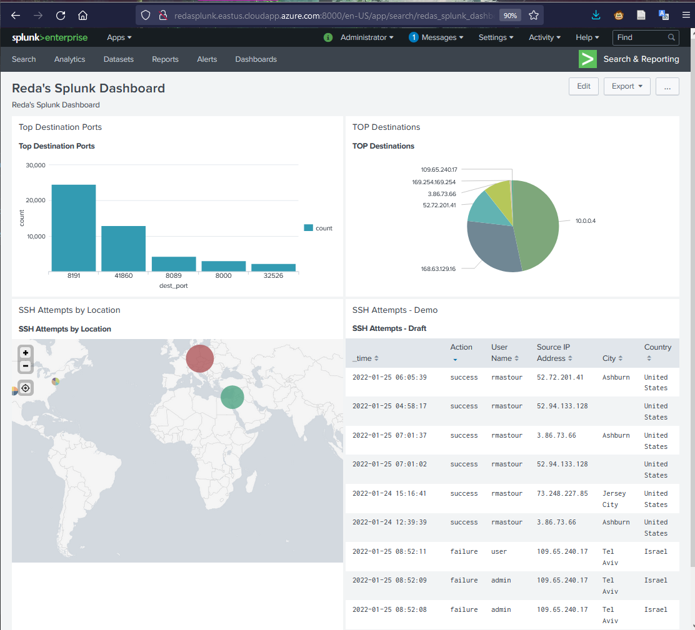

# Splunk_CrowdStrike_Breaches_Hunting
The Splunk CrowdStrike Breaches Hunting Project is a one-stop shop for forensics automation scripts.

<a href="#" target="_blank" rel="noreferrer"></a>


# Telemetry
Followed these steps:

### step 1:
Mount extra drives to host the telemetry data
```
df -h
pvcreate /dev/xvdb
sudo reboot
tail -f /var/log/auth.log
ls /dev/xvd*
lsblk -o NAME,HCTL,SIZE,MOUNTPOINT | grep -i "sd"
sudo parted /dev/sda --script mklabel gpt mkpart xfspart xfs 0% 100%
sudo parted /dev/sdb --script mklabel gpt mkpart xfspart xfs 0% 100%[B
sudo mkfs.xfs /dev/sda
sudo mkfs.xfs /dev/sda1
sudo partprobe /dev/sda1
```

### step 2:
PVS and LVS 
```
pvcreate /dev/sdb
df -h
pvcreate /dev/sdb1
pvs
vgcreate vg /dev/xvdb
vgcreate vg /dev/sdb
vgcreate vg /dev/sdb1
```

### step 3:
Create splunk vg
```
lvcreate -L 45G -n splunk vg
lvs
apt-get install xfsprogs
mkfs.xfs /dev/vg/splunk
```

### step 4:
Mount a mapper to Splunk executable 
```
cd /opt
ls
mkdir splunk
mount /dev/mapper/vg-splunk /opt/splunk
```

### step 5:
Edit /etc/fstab
```
df -h
vim /etc/fstab
```

```
# CLOUD_IMG: This file was created/modified by the Cloud Image build process
UUID=39bd9ac9-1b8c-487c-85b0-5b4726f12ada       /        ext4   defaults,discard        0 1
UUID=591D-B8EA  /boot/efi       vfat    umask=0077      0 1
/dev/disk/cloud/azure_resource-part1    /mnt    auto    defaults,nofail,x-systemd.requires=cloud-init.service,comment=cloudconfig       0       2
/dev/mapper/vg-splunk                   /opt/splunk   xfs    defaults,discard           0    0
```

### step 6:
Automate the mounting
```
unmount /opt/splunk/
umount /opt/splunk/
df -h
mount -a
df -h
```

### step 7:
Downloading and installing Splunk Enterprise
```
cd /tmp/
wget -O splunk-8.2.4-87e2dda940d1-Linux-x86_64.tgz 'https://download.splunk.com/products/splunk/releases/8.2.4/linux/splunk-8.2.4-87e2dda940d1-Linux-x86_64.tgz'
ls -ltrah
cd /opt
tar -xvzf /tmp/splunk-8.2.4-87e2dda940d1-Linux-x86_64.tgz
```

### step 8:
Accepting the license
```
cd splunk/
/opt/splunk/bin/splunk start --accept-license
ps ax | grep splunk
/opt/splunk/bin/splunk start --accept-license
ps ax | grep splunk
```

### step 9:
Adding Splunk at the bootsart of the vim
```
/opt/splunk//bin/splunk enable boot-start
/opt/splunk/bin/splunk status
tail -f /var/log/auth.log
```

### step 10:
Adjuting the indexes.conf and inputs.conf
```
cd /opt/splunk/etc/apps/search/local/
cat indexes.conf
cat inputs.conf
cd /opt/splunk/etc/apps/search/
/opt/splunk/bin/splunk btool inputs list --debug | grep auth.log
```

### step 11:
Adding firewall telemetry
```
cat inputs.conf
cd /
iptables -I INPUT 1 -j LOG
iptables -I FORWARD 1 -j LOG
iptables -I OUTPUT 1 -j LOG
tail -f /var/log/syslog
cd /opt/splunk/etc/apps/search/
cd local
ls
cat inputs.conf
/opt/splunk/bin/splunk btool inputs list --debug | grep auth.log
```

### step 12:
Editing the inputs.conf
```
cd /opt/splunk/etc/apps/search/local
vim inputs.conf
```

```
[monitor:///var/log/auth.log]
disabled = false
host = test-system
index = os
sourcetype = linux_secure

[monitor:///var/log/syslog]
disabled = false
host = test-system
index = os
sourcetype = syslog
```

restaring Splunk
```
/opt/splunk/bin/splunk restart
/opt/splunk/bin/splunk btool inputs list --debug | grep auth.log
cd /opt/splunk/etc/apps/search/local
ls -lshat
ls -al /opt/splunk/bin/splunk
ps ax | grep splunk
```

# Deployment 

Currently deployed on Azure: http://redasplunk.eastus.cloudapp.azure.com:8000/en-US/app/search/redas_splunk_dashboard

# Credit

Engineered and made possible by Reda Mastouri - 2022
